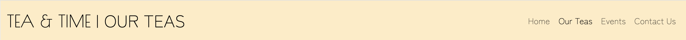
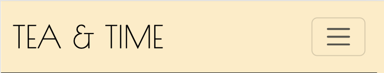
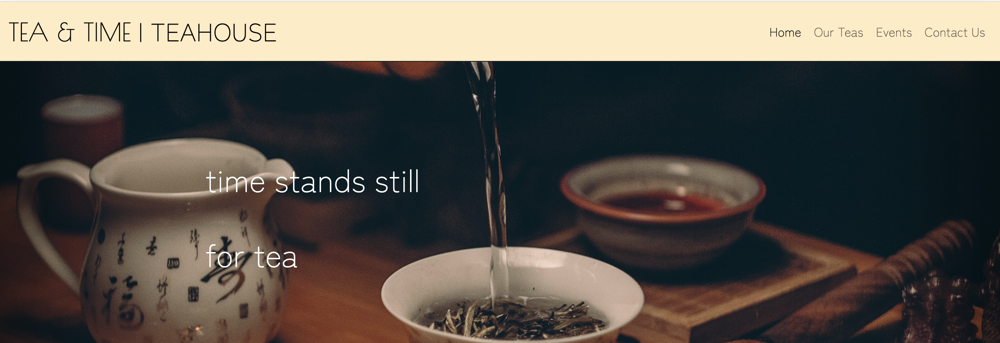
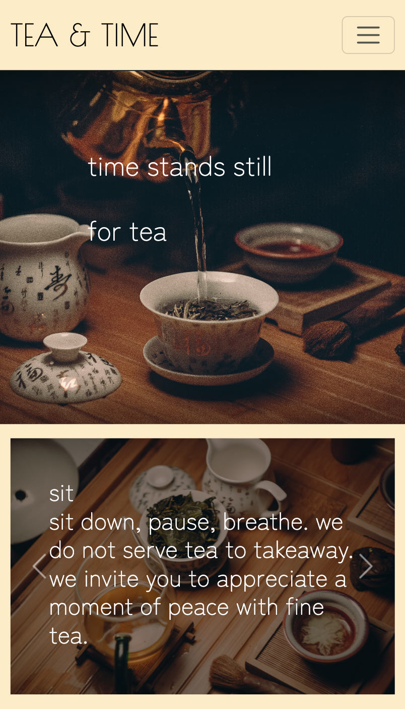
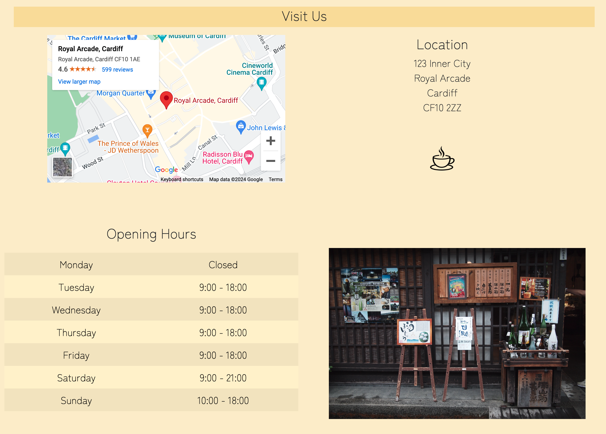
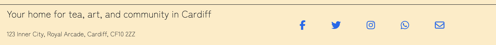
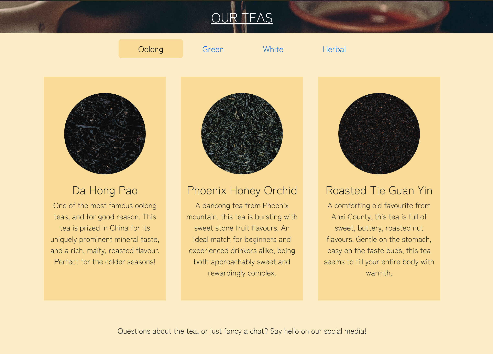
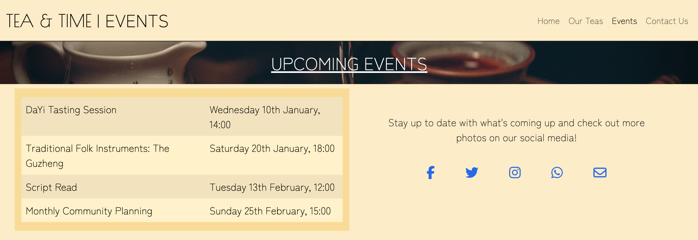
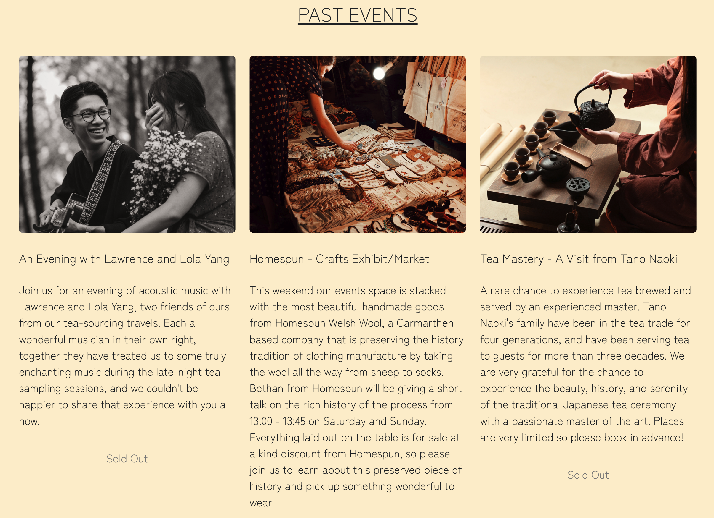

## Table of Contents

1. [Project Goals](#project-goals)
    1. [User Goals](#user-goals)
    2. [Site Goals](#site-goals)
2. [User Experience](#user-experience)
    1. [Target Audience](#target-audience)
    2. [User Stories](#user-stories)
3. [Design](#design)
    1. [Design Choices](#design-choices)
    2. [Colours](#colours)
    3. [Fonts](#fonts)
    4. [Structure](#structure)
    5. [Wireframes](#wireframes)
4. [Technologies](#technologies)
    1. [Languages](#languages)
    2. [Frameworks and Tools](#frameworks-and-tools)
5. [Features](#features)
6. [Testing](#testing)
    1. [HTML Validation](#HTML-validation)
    2. [CSS Validation](#CSS-validation)
    3. [Accessibility](#accessibility)
    4. [Performance](#performance)
    5. [Device testing](#performing-tests-on-various-devices)
    6. [Browser compatibility](#browser-compatibility)
    7. [Testing user stories](#testing-user-stories)
8. [Bugs](#bugs)
9. [Deployment](#deployment)
10. [Credits](#credits)
11. [Acknowledgements](#acknowledgements)

## Project Goals

This is a website for a fictional local teahouse. The intention of the website is to create a pleasant, accessible experience for all users on all devices, to encourage people to visit the teahouse, and to communicate a cohesive brand image.

### User Goals

- A strong first impression that communicates what service and atmosphere is being offered 
- Information that is easy to access and understand
- Looks attractive and functions well on a range of device screen sizes 
- Cohesive style and theming
- Clear easy invitation to visit the teahouse and use the event space

### Site Goals

 - Introduce the business ethos to the user in an appealing way
 - Increase visitors to the teahouse, and advertise the events space to potential customers 
 - Create an approachable image that makes engaging with the business easy and welcome, both on social media and by direct contact

### Developer Goals

- A beautiful website that performs well and consistently on a range of device sizes
- A landing page that immediately conveys what is unique and enticing about the business
- Accessible and easy to navigate
- Clear, simple information that is accessible and easy to take in at first glance
- Good use of the tools required to create an efficient product that meets the site's goals and creates value for the business

## User Experience

### Target Audience

- Potential visitors that are local to the teahouse
- Enthusiasts who aren't necessarily local but might want to visit 
- Parties that could use the events space for art, community, and trade events

### User Stories 

#### First-time User
1. As a first time user, I want to understand the experience the business is offering
2. As a first time user, I want to know what I can expect from a visit to the teahouse
3. As a first time user, I want to feel welcome as a newcomer who might not have prior experience
4. As a first time user, I want to know where and when I can visit the teahouse
5. As a first time user, I want to check out the business' social media to get a feel for the atmosphere of the establishment

#### Returning User
1. As a returning user, I want to be excited by the other things to try and learn about from the menu
2. As a returning user, I want to easily check what events are scheduled for the future 
3. As a returning user, I want an easy option to contact the business with questions or requests

#### Site Owner
1. As the site owner, I want to be able to easily rotate the menu with new items
2. As the site owner, I want to have one place where I can update customers with new events
3. As the site owner, I want users to enjoy the experience of the website and feel it matches the brand's image
4. As the site owner, I want users to feel excited and welcome when visiting the business
5. As the site owner, I want users to feel the business is approachable and responsive to contact
6. As the site owner, I want all users to have the same experience regardless of how they engage with the website

## Design

### Design Choices

My layout decisions were informed by development principles of presenting clear accessible information, using repetition and contrast to create a memorable and easily navigated site, and first-look learning. My decisions on the style and theming of the website were informed by the perspective of the site owner wanting to create a certain brand image; I have aimed for a relaxing, sophisticated aesthetic for a culturally leaning business. 

### Colours

I have chosen an analogous colour scheme for the site, emphasising a simplicity and gentle atmosphere that matches the brand image. The colours chosen are muted and warm pastel colours, intended to be soothing, with a darker accent colour to create some contrast and draw attention to structural layout information. I chose a yellow analogous colour scheme for a positive and relaxing tone.

Main theme colour: #fbefcc

Accent theme colour: #f7e09d

### Fonts

My two fonts for the website were selected from Google Fonts' sans-serif collection. I wanted to use fonts that presented a very clean, spacious look for the headings and text. The fonts I chose were those that I felt best matched the cohesive brand theming of the website and the accessibility focused design principles that informed the entire design process. I chose a more stylistic, lightweight typeface for the headings as the text is both larger, and thus easier to read, and more prominent as an aesthetic presence on the page.

[Zen Maru Gothic](https://fonts.google.com/specimen/Zen+Maru+Gothic)

[Poiret One](https://fonts.google.com/specimen/Poiret+One?query=poiret+one)

### Structure 

The website is designed to feel like one cohesive page, as much as that is possible. I have focused on consistency across all four pages of the site, again, as much as possible; each page shares a header and footer, uses the same design for page headings, and follows the same basic layout principles using the Bootstrap grid system. The website is navigated by using a clear, easy-to-use navigation bar at the top of the page. This principle of a consistent site experience is also the reason I chose to display the different content on the 'Our Teas' page as tabpanels with its own navigation bar; I aimed to create a similar experience navigating to different pages as the user has when changing tabs, where only the necessary content changes. 

The content I considered important enough to remain consistent across all pages is as follows:

- A header with the site logo, and on desktop an additional title for the page the user is currently viewing
- A navigation bar to access the different pages of the site
- A footer with the business address to be more memorable
- A short business tagline to reinforce the business ethos
- Links to the business social media pages

The site consists of four different pages and a unique 404 error page.

1. Homepage - a memorable landing page to grip the user's attention and communicate useful information on first glance
2. Our Teas - a menu page that shows users what teas are on offer at the business 
3. Events - a page that shows both upcoming and past events, advertising the kind of events people are able to attend, and showcasing the events space to potential tenants
4. Contact - a contact form for questions and business inquiries 

### Wireframes

## Technologies 

### Languages

HTML5
CSS3
### Frameworks and Tools

[Bootstrap v5.3](https://getbootstrap.com/docs/5.3/getting-started/introduction/)
[Visual Studio Code](https://code.visualstudio.com/)
[Git](github.com)
[Google Fonts](https://fonts.google.com/)
[Balsamiq](https://balsamiq.com/)
[Canva](https://www.canva.com/colors/color-wheel/)
[Obsidian](https://obsidian.md/)
[Pexels](https://www.pexels.com/)
[Font Awesome](https://fontawesome.com/)
[Favicon](https://favicon.io/)
[W3C Markup Validation Service](https://validator.w3.org/)
[W3C CSS Validation Service](https://jigsaw.w3.org/css-validator/)]
[WebAIM Contrast Checker](https://webaim.org/resources/contrastchecker/)
[Am I Responsive?](https://ui.dev/amiresponsive)
[WAVE Web Accessibility Evaluation Tools](https://wave.webaim.org/)

## Features

### Header and Navigation

- The navigation bar is featured on every page to allow consistent navigation around the site
- All pages are linked with the currently active page highlighted with a dark font colour
- On larger screen sizes, the header responsively adds a stylistic page title to the header. On smaller screen sizes this is not displayed to create a cleaner look without clutter
- On smaller screen sizes, the responsive navigation bar collapses into an easy-to-use hamburger menu

### Landing Page

- Main feature is a hero image with text that aims to immediately present the user with the brand image of a relaxing, sophisticated establishment
- Text spacing responsively adjusts to different screen sizes for consistent styling across all devices

### Company Ethos

- Three images with overlaid text that aims to give the user a clear idea of what the business is offering and the unique value it has
- Images contribute to the brand image of cultural appreciation, text conveys each of the three main points of company ethos 
- On larger screen sizes these are presented in three static columns, creating a cohesive and clean visual, and allowing the user to read at leisure
- On smaller screen sizes these images are presented on an automatically rotating carousel, to grab the user's attention and display all three without taking up three times the screen space on smaller devices. The carousel plays automatically upon loading the page but pauses on hover to make the content more accessible 

### Visiting Information

- Location of the business listed prominently, inviting users to visit 
- Embedded interactive Google maps feature further establishes a concrete idea of the business location for the user, allowing them to place it in context of the surroundings and more easily understand how to get there
- Opening hours listed in a clean, spacious table for ease of comprehension
- On larger screen sizes, additional image to complete the two-by-two grid structure and make the storefront immediately recognisable 

### Footer

- Contains the business address to further reinforce the memorability
- Social media links in a contrasting colour to draw attention and make engaging with the business easy
- Consistent across all pages to maintain cohesive aesthetic and to maintain focus on visiting and engaging with the business
- On larger device sizes with more room for a clean presentation, displays company tagline to re-state the company ethos 

### Tea Menu

- Selection tabs in pill style to choose between different tea types. Panels prevent clutter and keep the site focused, creating an easier experience reading and navigating the content
- The current tab is highlighted with an accent colour and font colour change
- Individual menu items for each tea, for stylistic content separation and contrast
- Images and descriptions for each tea, giving the user a clear and enticing idea of what to expect

### Upcoming Events

- A clear table layout to show the user what upcoming events they can attend in chronological order
- On larger screen sizes, an additional box for social media and other contact links, making it easy for the user to quickly check out event related content or make inquiries

### Past Events

- A collection of images and descriptions of previous events, highlighting to the user what kind of events they can look forward to in future and enticing the user to follow the upcoming schedule
- A variety of event types advertises the utility of the events space being offered for use, and aims at demonstrating to potential tenants the value of booking the space

## Media Content

https://www.pexels.com/photo/gold-kettle-pouring-hot-water-on-cup-of-tea-230477/
https://www.pexels.com/photo/red-envelopes-against-sprig-of-blooming-prunus-and-tea-7363760/
https://www.pexels.com/photo/white-ceramic-teapot-beside-cup-with-leaves-229493/
https://www.pexels.com/photo/food-wood-cup-mug-6545448/
Google Maps embed

https://www.pexels.com/photo/close-up-shot-of-dried-tea-leaves-6087517/
https://www.pexels.com/photo/close-up-shot-of-dried-tea-leaves-6087518/
https://www.pexels.com/photo/close-up-shot-of-dried-tea-leaves-6087604/
https://www.pexels.com/photo/pile-of-dried-leaves-5988177/
https://www.pexels.com/photo/close-up-shot-of-dried-tea-leaves-6087518/
https://www.pexels.com/photo/dried-tea-leaves-5501118/
https://www.pexels.com/photo/photo-of-dried-chamomile-flowers-6103501/
https://www.pexels.com/photo/dried-petals-of-purple-flowers-in-close-up-shot-6086886/
https://www.pexels.com/photo/close-up-shot-of-rooibos-tea-6087602/
https://www.pexels.com/photo/food-healthy-dark-dry-6087603/
https://www.pexels.com/photo/a-pile-of-dried-green-leaves-6103121/
https://www.pexels.com/photo/a-woman-holding-a-teapot-8952398/
https://www.pexels.com/photo/asian-couple-with-guitar-in-park-5985573/
https://www.pexels.com/photo/anonymous-woman-buying-traditional-handmade-souvenirs-in-market-4072329/
https://www.pexels.com/photo/exterior-of-old-traditional-asian-cafe-4070930/
## Deployment

## External Code
Cloned from Code Institute Template
Bootstrap Emmett extension
https://stackoverflow.com/questions/39817783/how-to-change-content-substitute-text-images-etc-on-different-resolutions
https://stackoverflow.com/questions/6046110/styling-form-with-label-above-inputs
https://stackoverflow.com/questions/66040890/trying-to-get-a-dark-overlay-on-my-bootstrap-carousel-image-video
## Testing
Lighthouse in devtools
Validation
## Bugs

