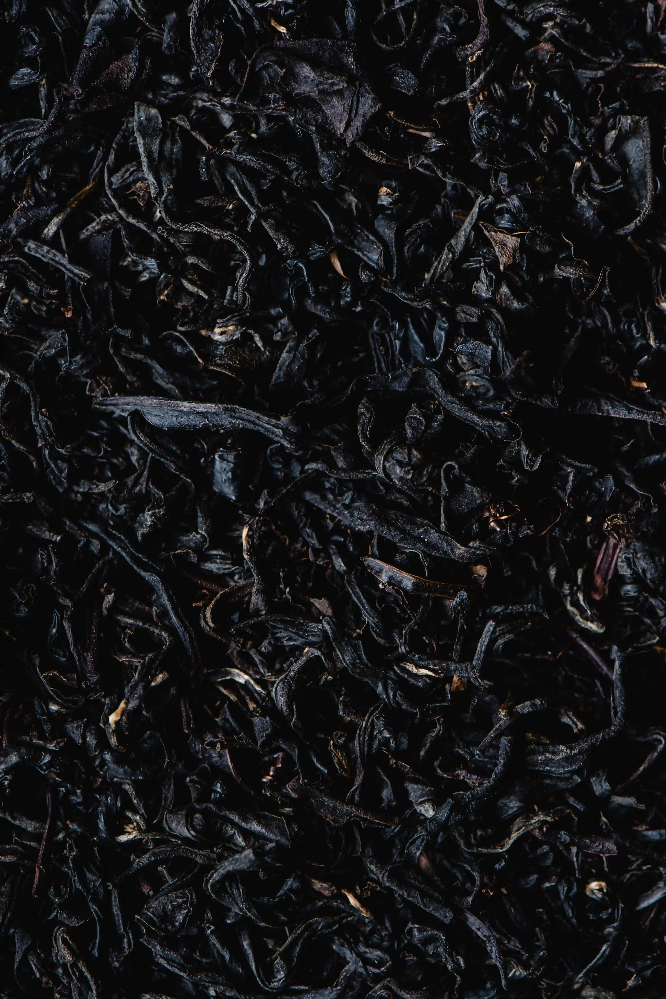

## Table of Contents

1. [Project Goals](#project-goals)
    1. [User Goals](#user-goals)
    2. [Site Goals](#site-goals)
2. [User Experience](#user-experience)
    1. [Target Audience](#target-audience)
    2. [User Stories](#user-stories)
3. [Design](#design)
    1. [Design Choices](#design-choices)
    2. [Colours](#colours)
    3. [Fonts](#fonts)
    4. [Structure](#structure)
    5. [Wireframes](#wireframes)
4. [Technologies](#technologies)
    1. [Languages](#languages)
    2. [Frameworks and Tools](#frameworks-and-tools)
5. [Features](#features)
6. [Testing](#testing)
    1. [HTML Validation](#HTML-validation)
    2. [CSS Validation](#CSS-validation)
    3. [Accessibility](#accessibility)
    4. [Performance](#performance)
    5. [Compatibility](#compatibility)
    6. [Testing user stories](#testing-user-stories)
7. [Bugs](#bugs)
8. [Deployment](#deployment)
9. [Credits](#credits)
10. [Acknowledgements](#acknowledgements)

## Project Goals

This is a website for a fictional local teahouse. The intention of the website is to create a pleasant, accessible experience for all users on all devices, to encourage people to visit the teahouse, and to communicate a cohesive brand image.

### User Goals

- A strong first impression that communicates what service and atmosphere is being offered 
- Information that is easy to access and understand
- Looks attractive and functions well on a range of device screen sizes 
- Cohesive style and theming
- Clear easy invitation to visit the teahouse and use the event space

### Site Goals

 - Introduce the business ethos to the user in an appealing way
 - Increase visitors to the teahouse, and advertise the events space to potential customers 
 - Create an approachable image that makes engaging with the business easy and welcome, both on social media and by direct contact

### Developer Goals

- A beautiful website that performs well and consistently on a range of device sizes
- A landing page that immediately conveys what is unique and enticing about the business
- Accessible and easy to navigate
- Clear, simple information that is accessible and easy to take in at first glance
- Good use of the tools required to create an efficient product that meets the site's goals and creates value for the business


## User Experience

### Target Audience

- Potential visitors that are local to the teahouse
- Enthusiasts who aren't necessarily local but might want to visit 
- Parties that could use the events space for art, community, and trade events

### User Stories 

#### First-time User
1. As a first time user, I want to understand the experience the business is offering
2. As a first time user, I want to know what I can expect from a visit to the teahouse
3. As a first time user, I want to feel welcome as a newcomer who might not have prior experience
4. As a first time user, I want to know where and when I can visit the teahouse
5. As a first time user, I want to check out the business' social media to get a feel for the atmosphere of the establishment

#### Returning User
1. As a returning user, I want to be excited by the other things to try and learn about from the menu
2. As a returning user, I want to easily check what events are scheduled for the future 
3. As a returning user, I want an easy option to contact the business with questions or requests

#### Site Owner
1. As the site owner, I want to be able to easily rotate the menu with new items
2. As the site owner, I want to have one place where I can update customers with new events
3. As the site owner, I want users to enjoy the experience of the website and feel it matches the brand's image
4. As the site owner, I want users to feel excited and welcome when visiting the business
5. As the site owner, I want users to feel the business is approachable and responsive to contact
6. As the site owner, I want all users to have the same experience regardless of how they engage with the website

## Design

### Design Choices

My layout decisions were informed by development principles of presenting clear accessible information, using repetition and contrast to create a memorable and easily navigated site, and first-look learning. My decisions on the style and theming of the website were informed by the perspective of the site owner wanting to create a certain brand image; I have aimed for a relaxing, sophisticated aesthetic for a culturally leaning business. 

### Colours

I have chosen an analogous colour scheme for the site, emphasising a simplicity and gentle atmosphere that matches the brand image. The colours chosen are muted and warm pastel colours, intended to be soothing, with a darker accent colour to create some contrast and draw attention to structural layout information. I chose a yellow analogous colour scheme for a positive and relaxing tone.

Main theme colour: #fbefcc

Accent theme colour: #f7e09d

### Fonts

My two fonts for the website were selected from Google Fonts' sans-serif collection. I wanted to use fonts that presented a very clean, spacious look for the headings and text. The fonts I chose were those that I felt best matched the cohesive brand theming of the website and the accessibility focused design principles that informed the entire design process. I chose a more stylistic, lightweight typeface for the headings as the text is both larger, and thus easier to read, and more prominent as an aesthetic presence on the page.

[Zen Maru Gothic](https://fonts.google.com/specimen/Zen+Maru+Gothic)

[Poiret One](https://fonts.google.com/specimen/Poiret+One?query=poiret+one)

### Structure 

The website is designed to feel like one cohesive page, as much as that is possible. I have focused on consistency across all four pages of the site, again, as much as possible; each page shares a header and footer, uses the same design for page headings, and follows the same basic layout principles using the Bootstrap grid system. The website is navigated by using a clear, easy-to-use navigation bar at the top of the page. This principle of a consistent site experience is also the reason I chose to display the different content on the 'Our Teas' page as tabpanels with its own navigation bar; I aimed to create a similar experience navigating to different pages as the user has when changing tabs, where only the necessary content changes. 

The content I considered important enough to remain consistent across all pages is as follows:

- A header with the site logo, and on desktop an additional title for the page the user is currently viewing
- A navigation bar to access the different pages of the site
- A footer with the business address to be more memorable
- A short business tagline to reinforce the business ethos
- Links to the business social media pages

The site consists of four different pages and a unique 404 error page.

1. Homepage - a memorable landing page to grip the user's attention and communicate useful information on first glance
2. Our Teas - a menu page that shows users what teas are on offer at the business 
3. Events - a page that shows both upcoming and past events, advertising the kind of events people are able to attend, and showcasing the events space to potential tenants
4. Contact - a contact form for questions and business inquiries 


### Wireframes


## Technologies 

### Languages

HTML5
CSS3
### Frameworks and Tools

[Bootstrap v5.3](https://getbootstrap.com/docs/5.3/getting-started/introduction/)
[Visual Studio Code](https://code.visualstudio.com/)
[Git](github.com)
[Google Fonts](https://fonts.google.com/)
[Balsamiq](https://balsamiq.com/)
[Canva](https://www.canva.com/colors/color-wheel/)
[Obsidian](https://obsidian.md/)
[Pexels](https://www.pexels.com/)
[Imagemin](https://github.com/imagemin/imagemin-cli)
[cwebp Encoder](https://developers.google.com/speed/webp/docs/cwebp)
[Font Awesome](https://fontawesome.com/)
[Favicon](https://favicon.io/)
[W3C Markup Validation Service](https://validator.w3.org/)
[W3C CSS Validation Service](https://jigsaw.w3.org/css-validator/)]
[WebAIM Contrast Checker](https://webaim.org/resources/contrastchecker/)
[Accessible Color Generator](https://www.learnui.design/tools/accessible-color-generator.html)
[Am I Responsive?](https://ui.dev/amiresponsive)
[WAVE Web Accessibility Evaluation Tools](https://wave.webaim.org/)


## Features

### Header and Navigation

- The navigation bar is featured on every page to allow consistent navigation around the site
- All pages are linked with the currently active page highlighted with a dark font colour
- On larger screen sizes, the header responsively adds a stylistic page title to the header. On smaller screen sizes this is not displayed to create a cleaner look without clutter
- On smaller screen sizes, the responsive navigation bar collapses into an easy-to-use hamburger menu


### Landing Page

- Main feature is a hero image with text that aims to immediately present the user with the brand image of a relaxing, sophisticated establishment
- Text spacing responsively adjusts to different screen sizes for consistent styling across all devices


### Ethos Images

- Three images with overlaid text that aims to give the user a clear idea of what the business is offering and the unique value it has
- Images contribute to the brand image of cultural appreciation, text conveys each of the three main points of company ethos 
- On larger screen sizes these are presented in three static columns, creating a cohesive and clean visual, and allowing the user to read at leisure
- On smaller screen sizes these images are presented on an automatically rotating carousel, to grab the user's attention and display all three without taking up three times the screen space on smaller devices. The carousel plays automatically upon loading the page but pauses on hover to make the content more accessible 


### Visiting Information

- Location of the business listed prominently, inviting users to visit 
- Opening hours listed in a clean, spacious table for ease of comprehension
- On larger screen sizes, additional image to complete the two-by-two grid structure and make the storefront immediately recognisable 


### Map

- Embedded interactive Google maps feature further establishes a concrete idea of the business location for the user, allowing them to place it in context of the surroundings and more easily understand how to get there


### Footer

- Contains the business address to further reinforce the memorability
- Social media links in a contrasting colour to draw attention and make engaging with the business easy
- Links to automatically open a new email or WhatsApp text
- Consistent across all pages to maintain cohesive aesthetic and to maintain focus on visiting and engaging with the business
- On larger device sizes with more room for a clean presentation, displays company tagline to re-state the company ethos 


### Tea Menu

- Selection tabs in pill style to choose between different tea types. Panels prevent clutter and keep the site focused, creating an easier experience reading and navigating the content
- The current tab is highlighted with an accent colour and font colour change
- Individual menu items for each tea, for stylistic content separation and contrast
- Images and descriptions for each tea, giving the user a clear and enticing idea of what to expect


### Upcoming Events

- A clear table layout to show the user what upcoming events they can attend in chronological order
- On larger screen sizes, an additional box for social media and other contact links, making it easy for the user to quickly check out event related content or make inquiries


### Past Events

- A collection of images and descriptions of previous events, highlighting to the user what kind of events they can look forward to in future and enticing the user to follow the upcoming schedule
- A variety of event types advertises the utility of the events space being offered for use, and aims at demonstrating to potential tenants the value of booking the space


### Contact Form

- A simple, clear, responsive contact form to make it easy and inviting for the user to write to the business with any questions or inquiries
- Aims to provide an avenue to easily address any concerns that might prevent a user from potentially visiting
- Easy-to-access inquiries for parties who are looking to book the events space
- Form currently posts to a Code Institute formdump page


### 404 Error

- A simple page to redirect the user back to the homepage when encountering a 404 error. The navigation bar is still accessible if the user chooses to visit another page instead


## Testing

### HTML Validation

Validated with the W3C Markup Validation Service

index.html [Results](https://validator.w3.org/nu/?doc=https%3A%2F%2Famorychambers.github.io%2Fteahouse-project%2Findex.html)
The validator lists six errors for this page, because in the carousel code snippet from Bootstrap v5.3 it was more practical to use six img elements for the carousel slides, as opposed to using a CSS background. These images do not have an alt text, in the same way any other background image would not, as the relevant textual content and context is already present as a paragraph element overlaying the slide.

our-teas.html [Results](https://validator.w3.org/nu/?doc=https%3A%2F%2Famorychambers.github.io%2Fteahouse-project%2Four-teas.html)
No errors or warnings

events.html [Results](https://validator.w3.org/nu/?doc=https%3A%2F%2Famorychambers.github.io%2Fteahouse-project%2Fevents.html)
No errors or warnings

contact.html [Results](https://validator.w3.org/nu/?doc=https%3A%2F%2Famorychambers.github.io%2Fteahouse-project%2Fcontact.html)
No errors or warnings

404.html [Results](https://validator.w3.org/nu/?doc=https%3A%2F%2Famorychambers.github.io%2Fteahouse-project%2F404.html&__cf_chl_tk=BpbdRkXlwJ_fZmzNUC7.62S7_0b7SlerSby3X5jwV6I-1705515733-0-gaNycGzNDWU)
No errors or warnings

### CSS Validation

Validated with the W3C CSS Validation Service

index.html [Results](https://jigsaw.w3.org/css-validator/validator?uri=https%3A%2F%2Famorychambers.github.io%2Fteahouse-project%2F&profile=css3svg&usermedium=all&warning=1&vextwarning=&lang=en)

The CSS validation service lists 16 errors that are common and distinct to Bootstrap content, which I have used on the site. 

When validating my own style.css document by direct upload, it returns no errors.


### Accessibility

Validated with the WAVE Web Accessibility Evaluation Tools

index.html [Results](https://wave.webaim.org/report#/https://amorychambers.github.io/teahouse-project/)

The accessibility tool lists six errors for missing alt text on images; as discussed above this is a consequence of the Bootstrap carousel slides using img elements as a background rather than using a CSS property, which do not need alt texts. I am confident that these errors are therefore not a legitimate accessibility concern, as much as they are a quirk of the Bootstrap carousel code snippet I have chosen to use. The other four contrast errors are similarly caused by the use of an img element as a background rather than a CSS background; the accessibility tool is checking the contrast of the text against the background colour of the site, as opposed to the actual background colour of the img element used. Whilst this presents a valid learning experience going forward to be more mindful of accessibility when using code snippets, in this project I have decided that as it does not present an actual accessibility error on the page, it does not need to be corrected.

our-teas.html [Results](https://wave.webaim.org/report#/https://amorychambers.github.io/teahouse-project/our-teas.html)

The accessibility tool lists one contrast error, for low contrast between the page heading and the background image. Addressed by increasing the font size and font weight to be more readable.

events.html [Results](https://wave.webaim.org/report#/https://amorychambers.github.io/teahouse-project/events.html)

The accessibility tool lists one contrast error, for low contrast between the page heading and the background image. Addressed by increasing the font size and font weight to be more readable.

contact.html [Results](https://wave.webaim.org/report#/https://amorychambers.github.io/teahouse-project/contact.html)

The accessibility tool lists one contrast error, for low contrast between the page heading and the background image. Addressed by increasing the font size and font weight to be more readable.

404.html [Results](https://wave.webaim.org/report#/https://amorychambers.github.io/teahouse-project/404.html)

No errors listed


### Performance

Performance testing by Google Lighthouse in Google Chrome Developer Tools

The maximum performance I could achieve for the index and our-teas pages using the minimal Bootstrap CSS and JavaScript files was 87 and 84. The Bootstrap framework was incredibly useful and efficient in creating the site, but the large stylesheets it has to load create a long render delay. I was able to improve performance on all pages by moving the Font Awesome script from the head of the HTML to the bottom of the body, and by using an undisplayed img element to force the browser to load the background hero image faster, as this was the LCP.

index.html

To further improve performance, I used the lazy loading attribute on the embedded Google maps element and on the desktop image element at the bottom of the page.

our-teas.html


events.html


contact.html


404.html


### Compatibility 

The website was tested and proved fully functional on the following devices;

- Macbook Pro
- Windows 10 PC
- iPhone 13

The website was tested and proved fully functional on the following browsers;

- Google Chrome
- Safari
- Firefox
- Opera
- Microsoft Edge


### Testing User Stories

#### First-Time User

1. As a first-time user, I want to know what the business is offering

| **Feature** | **Action** | **Expected Result** | **Actual Result** |
| ---- | ---- | ---- | ---- |
| Ethos Images | Open homepage | Presented with text and images conveying intended experience | Works as expected |
| Tea Menu | Click on Our Teas page in the navigation bar | Browse full menu of products the business offers | Works as expected |

2. As a first-time user, I want to make plans to visit the teahouse

| **Feature** | **Action** | **Expected Result** | **Actual Result** |
| ---- | ---- | ---- | ---- |
| Visiting Information | On homepage, scroll down below ethos images | Find opening hours and address | Works as expected |
| Map | On homepage, scroll down below ethos images | Find interactive Google map to help place the address | Works as expected |
| Footer | Scroll down to see the footer on all pages | Find the business address | Works as expected |

3. As a first-time user, I want to learn more about tea 

| **Feature** | **Action** | **Expected Result** | **Actual Result** |
| ---- | ---- | ---- | ---- |
| Tea Menu | Click on Our Teas page in navigation bar. Click between different tabs for tea types | See the range of teas and descriptions offered by the business | Works as expected |

4. As a first-time user, I want to know what kind of events I might be able to attend

| **Feature** | **Action** | **Expected Result** | **Actual Result** |
|-------------|------------|---------------------|-------------------|
| Past Events | Click to Events page in navigation bar | Find past events section describing previous events | Works as expected |

5. As a first-time user, I want to check out the company's social media

| **Feature** | **Action** | **Expected Result** | **Actual Result** |
| ---- | ---- | ---- | ---- |
| Footer | Scroll to the footer of any page | Find social media links | Works as expected |
| Upcoming Events | Click on Events page on desktop | Find social media links | Works as expected |

6. As a first-time user, I have questions about the accessibility of the business location

| **Feature** | **Action** | **Expected Result** | **Actual Result** |
| ---- | ---- | ---- | ---- |
| Contact Form | Click on Contact Us page in navigation bar | Find and use contact form | Works as expected |
| Footer | Scroll to the footer of any page | Find social media links to contact the business | Works as expected |

7. As a first-time user, I want to explore the possibility of renting the events space for my project

| **Feature** | **Action** | **Expected Result** | **Actual Result** |
| ---- | ---- | ---- | ---- |
| Past Events | Click on Events page in navigation bar | Find the past events section to learn about what events could be held at the business | Works as expected |
| Contact Form | Click on Contact Us page in navigation bar | Find and use contact form | Works as expected |


#### Returning User

8. As a returning user, I want to see what new events are coming up

| **Feature** | **Action** | **Expected Result** | **Actual Result** |
|-------------|------------|---------------------|-------------------|
| Upcoming Events | Click on Events page in the navigation bar | Find table for upcoming events with dates | Works as expected |

9. As a returning user, I want to rent and use the events space myself

| **Feature** | **Action** | **Expected Result** | **Actual Result** |
| ---- | ---- | ---- | ---- |
| Past Events | Click on Events page in navigation bar | Find the past events section to learn about what events could be held at the business | Works as expected |
| Contact Form | Click on Contact Us page in navigation bar | Find and use contact form | Works as expected |

10. As a returning user, I want to see what new teas are on offer at the business

| **Feature** | **Action** | **Expected Result** | **Actual Result** |
| ---- | ---- | ---- | ---- |
| Tea Menu | Click on Our Teas page in navigation bar | Navigate through tea menu, check for prominent 'New' badge | Works as expected |


#### Site Owner

11. As the site owner, I want users to get a strong first impression of the business's brand and ethos from the site

| **Feature** | **Action** | **Expected Result** | **Actual Result** |
| ---- | ---- | ---- | ---- |
| Landing Page | Open homepage | Presented with hero image and site branding | Works as expected |
| Ethos Images | Open Homepage | Presented on desktop landing page; scroll to beneath hero image on mobile | Works as expected |

12. As the site owner, I want users to have an easy time navigating around the website

| **Feature** | **Action** | **Expected Result** | **Actual Result** |
| ---- | ---- | ---- | ---- |
| Header and Navigation | Click on any link in the navigation bar from any page | Navigate to different site pages | Works as expected |

13. As the site owner, I want users to be enticed to visit the teahouse

| **Feature** | **Action** | **Expected Result** | **Actual Result** |
| ---- | ---- | ---- | ---- |
| Ethos Images | Open homepage | Ethos images present a welcoming and inviting business | Works as expected |
| Tea Menu | Click on Our Teas page in navigation bar | Browse through tabs of different teas on offer with enticing descriptions | Works as expected |
| Past Events | Click on Events page in navigation bar | User can read about the different kinds of exciting events that have happened previously | Works as expected |
| Upcoming Events | Click on Events page in navigation bar | User can see what upcoming events they are able to attend |  |

14. As the site owner, I want users to feel welcome and encouraged to contact and engage with the business if they have any questions or issues 

| **Feature** | **Action** | **Expected Result** | **Actual Result** |
| ---- | ---- | ---- | ---- |
| Contact Form | Click on Contact Us page in navigation bar | Find and use contact form | Works as expected |
| Footer | Scroll to the footer of any page | Find social media links to contact the business | Works as expected |

15. As the site owner, I want users to remember where the business is located for them to visit 

| **Feature** | **Action** | **Expected Result** | **Actual Result** |
| ---- | ---- | ---- | ---- |
| Location | On homepage, scroll down below ethos images | Find the business address | Works as expected |
| Map | On homepage, scroll down below ethos images | Find interactive Google map to help place the address | Works as expected |
| Footer | Scroll down to see the footer on all pages | Find the business address | Works as expected |


## Bugs

1. I ran into an issue with the alignment of the Our Teas panels, wherein I could not get each div for each individual tea to align properly on desktop, regardless of the size of description. For safer and clearer version control I moved to a new branch to experiment. At first I attempted to use fixed height divs but this created another issue wherein the divs no longer lined up vertically on mobile. I reverted to the original to remove any changes made during the first attempt, and secondly tried to solve the problem using CSS alignment. I made all the divs display as inline-block elements to try and use flexbox to line them up properly and responsively in the Bootstrap grid on all devices. This did not work as the divs no longer held together in an equally spaced and clean grid system, and I could not make them line up vertically with the description alongside the image, uniquely to the tablet view. I attempted to use the min-content and max-content CSS properties to create equally sized divs for each tea on desktop, but this further complicated the layout problem on tablet styles. I solved the problem by placing each individual tea menu item in its own row as opposed to columns within a row, giving both the image and description its own Bootstrap column, and lining them up differently based on screen size. This allowed me to use a combination of Bootstrap alignment classes and media queries to create responsive divs for each menu item, that can easily change layout on different sizes, and use a fixed height on desktop for a cleaner, equal aesthetic. 

##### Old Code 

```
<div class="row tea mx-3">

<div class="col">



<h3>Da Hong Pao</h3>

<p>One of the most famous oolong teas, and for good reason. This tea is prized in

China for its uniquely prominent mineral taste, and a rich, malty, roasted

flavour. Perfect for the colder seasons!</p>

</div>

</div>

```

##### New Code

```
<div class="row tea align-top d-lg-inline-block mx-lg-3">

<div class="col-sm-6 col-lg-12">


</div>

<div class="col-sm-6 col-lg-12">

<h3>Da Hong Pao <span class="badge bg-danger">New!</span></h3>

<p>One of the most famous oolong teas, and for good reason. This tea is prized in

China for its uniquely prominent mineral taste, and a rich, malty, roasted

flavour. Perfect for the colder seasons!</p>

</div>

</div>
```


The only other bugs encountered during the project were firstly a minor text size and overflow issue that was resolved by switching from fixed pixel font sizes to a more responsive em size unit, and layout mismatches that were resolved by making small changes within the Bootstrap grid layout. 


## Deployment


## Credits

### Media Content

In this project I have used stock images to represent what might more normally be custom content for a business. The majority of these stock images were downloaded from and used license-free from [Pexels](pexels.com)
#### Homepage

[Hero image, Mykola Osmachko](https://www.pexels.com/photo/gold-kettle-pouring-hot-water-on-cup-of-tea-230477/)
['Say Hello' ethos background, Angela Roma](https://www.pexels.com/photo/red-envelopes-against-sprig-of-blooming-prunus-and-tea-7363760/)
['Sit' ethos background, Mykola Osmachko](https://www.pexels.com/photo/white-ceramic-teapot-beside-cup-with-leaves-229493/)
['Share' ethos background, Tima Miroshnichenko](https://www.pexels.com/photo/food-wood-cup-mug-6545448/)
[Teahouse exterior image, Mingche Lee](https://www.pexels.com/photo/exterior-of-old-traditional-asian-cafe-4070930/)
[Teacup icon, UX Wing](https://uxwing.com/coffee-icon/)

#### Our Teas

[Da Hong Pao oolong, Eva Bronzini](https://www.pexels.com/photo/close-up-shot-of-dried-tea-leaves-6087517/)
[Phoenix Honey Orchid oolong, Eva Bronzini](https://www.pexels.com/photo/close-up-shot-of-dried-tea-leaves-6087518/)
[Roasted Tie Guan Yin oolong, Eva Bronzini](https://www.pexels.com/photo/close-up-shot-of-dried-tea-leaves-6087604/)
[Genmaicha green, Eva Bronzini](https://www.pexels.com/photo/food-healthy-dark-dry-6087603/)
[Biluochun green, Eva Bronzini](https://www.pexels.com/photo/a-pile-of-dried-green-leaves-6103121/)
[Silver Needle white, Eva Bronzini](https://www.pexels.com/photo/pile-of-dried-leaves-5988177/)
[White Peony white, Eva Bronzini](https://www.pexels.com/photo/close-up-shot-of-dried-tea-leaves-6087518/)
[Earl Grey white, Eva Bronzini](https://www.pexels.com/photo/dried-tea-leaves-5501118/)
[Chamomile herbal, Eva Bronzini](https://www.pexels.com/photo/photo-of-dried-chamomile-flowers-6103501/)
[Rosehip herbal, Eva Bronzini](https://www.pexels.com/photo/dried-petals-of-purple-flowers-in-close-up-shot-6086886/)
[Rooibos herbal, Eva Bronzini](https://www.pexels.com/photo/close-up-shot-of-rooibos-tea-6087602/)

#### Events 

[Musician Event, Tiến Trần](https://www.pexels.com/photo/asian-couple-with-guitar-in-park-5985573/)
[Craft Market event, Mew wy.](https://www.pexels.com/photo/anonymous-woman-buying-traditional-handmade-souvenirs-in-market-4072329/)
[Tea Mastery Visit event, Ivan Samkov](https://www.pexels.com/photo/a-woman-holding-a-teapot-8952398/)


### External Code

- Initial template with .devcontainer folder cloned from Code Institute [ci-full-template](https://github.com/Code-Institute-Org/ci-full-template)
- Initial boilerplate HTML head from [Emmet extension](https://emmet.io/) in Visual Studio Code
- Code snippet for navigation bar from [Bootstrap v5.3 documentation](https://getbootstrap.com/docs/5.3/components/navbar/)
- Code snippet for carousel from [Bootstrap v5.3 documentation](https://getbootstrap.com/docs/5.3/components/carousel/)
- Code snippet for tabpanels from [Bootstrap v5.3 documentation](https://getbootstrap.com/docs/5.3/components/navs-tabs/)
- Advice for adding a dark overlay to Bootstrap's carousel slides taken from Stack Overflow user [Minal Chauhan](https://stackoverflow.com/questions/66040890/trying-to-get-a-dark-overlay-on-my-bootstrap-carousel-image-video) 
- Advice for making icon links more accessible taken from [Kitty Giraudel](https://kittygiraudel.com/2020/12/10/accessible-icon-links/)
- Advice to add an undisplayed image to the DOM to improve the render delay on images taken from [Gijo Varghese, WP Speed Matters](https://wpspeedmatters.com/speed-up-background-images/)


## Deployment


## Credits


